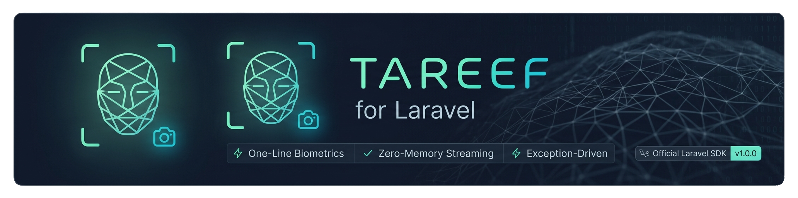

<p align="center">
  <a href="https://tareef.g4t.io">
    
  </a>
</p>

# Tareef for Laravel

The official Laravel SDK for [Tareef](https://tareef.g4t.io) — register a person, verify a face, manage your library, in one line of code.

```php
use Tareef\Laravel\Facades\Tareef;

$result = Tareef::verify($request->file('selfie'));

if ($result->matched) {
    return "Welcome back, {$result->name}.";
}
```

## Requirements

- PHP 8.2+
- Laravel 10, 11, 12, or 13
- A Tareef account ([sign up free](https://tareef.g4t.io/register))

## Install

```bash
composer require tareef/laravel
```

The package self-registers via Laravel's auto-discovery. Add your API key to `.env`:

```env
TAREEF_API_KEY=frs_live_xxxxxxxxxxxxxxxxxxxxxxxx
```

Grab your key from the Tareef dashboard → **API Keys** → **Create new key**.

Optionally publish the config to tune timeouts / retries:

```bash
php artisan vendor:publish --tag=tareef-config
```

## Quickstart

### Enroll a person

```php
use Tareef\Laravel\Facades\Tareef;

$person = Tareef::register(
    name:   $request->input('name'),
    images: [$request->file('photo')],   // UploadedFile, file path, or SplFileInfo
    phone:  $request->input('phone'),    // optional
);

return response()->json([
    'uuid' => $person->uuid,
    'images_indexed' => $person->imageCount,
]);
```

### Verify a face

```php
$result = Tareef::verify($request->file('selfie'));

if ($result->matched) {
    return view('door.open', [
        'name'  => $result->name,
        'score' => $result->score,    // lower = closer match
    ]);
}

return view('door.unknown');
```

### Compare two faces (1:1)

Measure how similar two images are without enrolling anyone — ideal for KYC
("does this selfie match this ID photo?"). A no-match is **not** an exception.

```php
$result = Tareef::compare($request->file('selfie'), $request->file('id_photo'));

if ($result->match) {
    return 'Same person — '.round($result->similarity * 100).'% similar';
}
// $result->distance (lower = closer), $result->similarity (1.0 = identical)
```

### Add more reference photos

```php
$person = Tareef::find($uuid);
$person->addImages([
    $request->file('photo_1'),
    $request->file('photo_2'),
]);
```

### List your library

```php
$people = Tareef::list(limit: 50);
// Illuminate\Support\Collection<Person>

foreach ($people as $p) {
    echo "{$p->name} — {$p->imageCount} photos\n";
}
```

### Delete a person

```php
Tareef::delete($uuid);
// or, if you already have the object:
$person->delete();
```

### Health check

```php
if (! Tareef::health()) {
    Log::warning('Tareef is unreachable.');
}
```

## Error handling

Every failure path throws a typed exception subclassed from `Tareef\Laravel\Exceptions\TareefException`.

```php
use Tareef\Laravel\Exceptions\{
    FaceAlreadyExistsException,
    NoFaceDetectedException,
    QuotaExceededException,
    AuthenticationException,
    ServiceUnavailableException,
    TareefException,
};

try {
    $person = Tareef::register(name: $name, images: [$file]);
} catch (FaceAlreadyExistsException $e) {
    // Same face is already enrolled — fetch the existing record.
    $existing = Tareef::find($e->existingUuid);
    return back()->with('warning', "Already enrolled as {$existing->name}.");
} catch (NoFaceDetectedException $e) {
    return back()->withErrors(['photo' => 'No face was detected. Try a clearer photo.']);
} catch (QuotaExceededException) {
    return redirect()->route('billing')->with('error', 'Plan quota exhausted.');
} catch (AuthenticationException) {
    Log::critical('TAREEF_API_KEY is missing or revoked.');
    abort(500);
} catch (ServiceUnavailableException) {
    return back()->with('error', 'Tareef is having issues. Try again in a minute.');
} catch (TareefException $e) {
    report($e);
    return back()->with('error', $e->getMessage());
}
```

`Tareef::verify()` and `Tareef::compare()` are different: a no-match is **not** an exception — they return a result object with `matched`/`match` set to `false`. Only auth, quota, "no face in the image", and network errors throw.

## API reference

| Call | Returns | Throws on … |
|------|---------|-------------|
| `Tareef::register($name, $images, $phone?)` | `Person` | duplicate face, no face, auth, quota |
| `Tareef::verify($image)` | `VerifyResult` | no face, auth, quota, network |
| `Tareef::compare($imageA, $imageB)` | `CompareResult` | no face, auth, quota, network |
| `Tareef::find($uuid)` | `?Person` (null = not found) | auth |
| `Tareef::findOrFail($uuid)` | `Person` | not found, auth |
| `Tareef::list($limit = 100)` | `Collection<Person>` | auth |
| `Tareef::addImagesTo($uuid, $images)` | `Person` (refreshed) | not found, auth, quota |
| `Tareef::delete($uuid)` | `true` | not found, auth |
| `Tareef::health()` | `bool` | never throws |

### `Person`

```php
$person->uuid;          // string
$person->name;          // ?string
$person->phone;         // ?string
$person->imageCount;    // int
$person->images;        // string[]  — URLs/paths returned by the API
$person->createdAt;     // ?Carbon\Carbon

$person->addImages([$file]);   // → Person
$person->delete();             // → bool
$person->toArray();            // → array
```

### `VerifyResult`

```php
$result->matched;       // bool   — branch on this
$result->uuid;          // ?string (the matched person's UUID, if any)
$result->name;          // ?string
$result->score;         // ?float  (lower = closer; <0.35 = confident match)
$result->samples;       // ?int    (how many reference photos contributed)
$result->status;        // 'ok' | 'not_found'
$result->message;       // ?string
```

### `CompareResult`

```php
$result->match;         // bool   — same person? (uses the app's strictness)
$result->distance;      // ?float  (cosine distance; lower = closer)
$result->similarity;    // ?float  (1 − distance; 1.0 = identical)
$result->threshold;     // ?float  (the cutoff the decision used)
$result->status;        // 'ok'
```

## Configuration

`config/tareef.php` (publish to override):

| Key | Env var | Default | Notes |
|-----|---------|---------|-------|
| `api_key` | `TAREEF_API_KEY` | — | **Required.** Bearer token, treat like a password. |
| `base_url` | `TAREEF_BASE_URL` | `https://tareef.g4t.io` | Override for self-hosted Tareef. |
| `timeout` | `TAREEF_TIMEOUT` | `30` | Per-request, seconds. |
| `retries` | `TAREEF_RETRIES` | `2` | Transient-failure retries before throwing. |
| `throw_on_quota` | `TAREEF_THROW_ON_QUOTA` | `true` | Set to `false` to receive failure results instead of `QuotaExceededException`. |

## Image inputs

Every method that takes images accepts any of:

- `\Illuminate\Http\UploadedFile` — straight from `$request->file('photo')`
- `\SplFileInfo` / `\Illuminate\Http\File` — for files you've already moved
- `string` — an absolute path on disk

The SDK streams them as multipart parts; nothing is loaded fully into PHP memory.

## Testing your integration

`Tareef` uses Laravel's HTTP client under the hood, so you can mock it with the standard `Http::fake()`:

```php
use Illuminate\Support\Facades\Http;

Http::fake([
    '*/api/v1/verify' => Http::response([
        'success' => true, 'uuid' => 'fixture-uuid',
        'name' => 'Test Person', 'score' => 0.1, 'samples' => 1,
    ]),
]);

$result = Tareef::verify(UploadedFile::fake()->image('selfie.jpg'));

$this->assertTrue($result->matched);
$this->assertSame('Test Person', $result->name);
```

## Versioning

Semver. The first stable release is `1.0.0`. Any breaking change to the public API (`Tareef::*`, the resource DTOs, or the exception hierarchy) bumps the major version.

## License

MIT. See [LICENSE](LICENSE).

## Links

- Tareef dashboard — https://tareef.g4t.io
- API reference  — https://tareef.g4t.io/docs
- Status         — https://tareef.g4t.io/status
- Support        — info@g4t.online
# tareef-laravel
